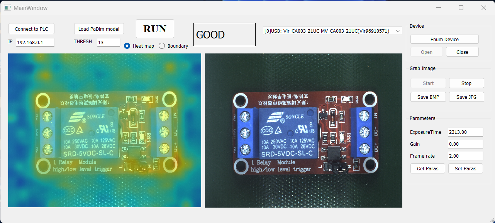
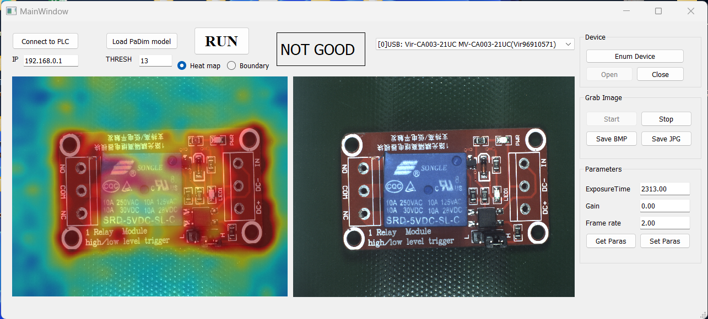

# Circuit Board Anomaly Detection
A simple graphic user interface that use industrial camera to capture images, PaDim model to detect anomalies and communicate with Simens PLC\
You must install the SDK of Hikrobot camera from link: https://www.hikrobotics.com/en/machinevision \
Example results

## Install
git clone https://github.com/TheNho/Circuit-Board-Anomaly-Detection.git \
cd Circuit-Board-Anomaly-Detection \
pip install -r requirements.txt
## Run
python main.py
## Code References
Padim model: https://github.com/OpenAOI/anodet
